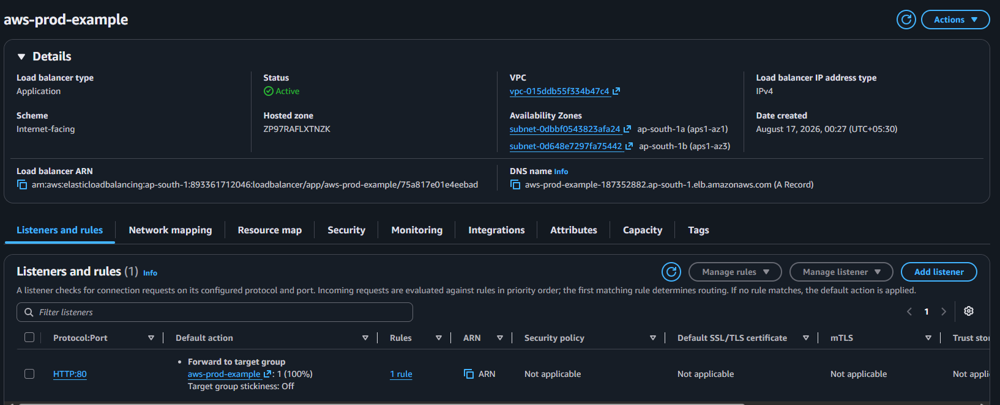
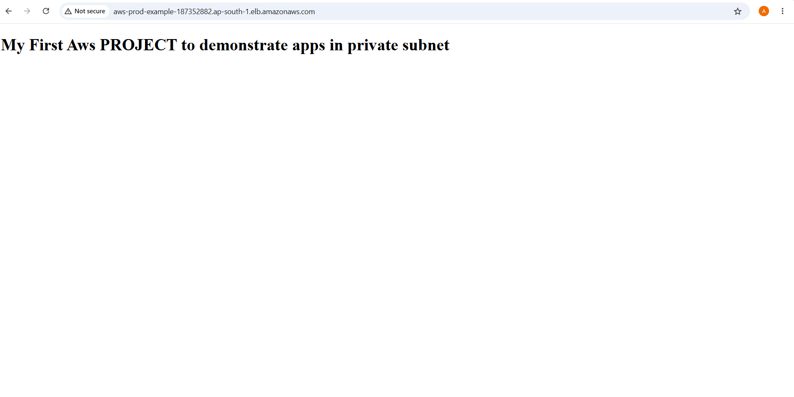
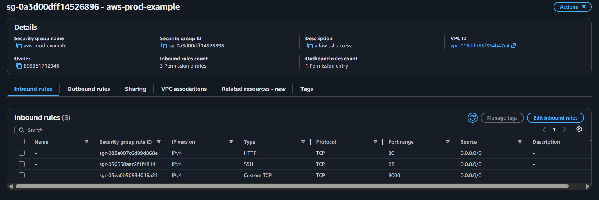
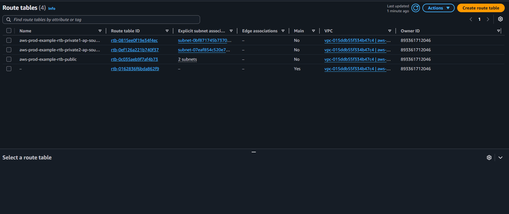
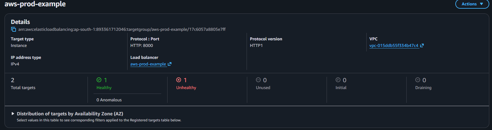
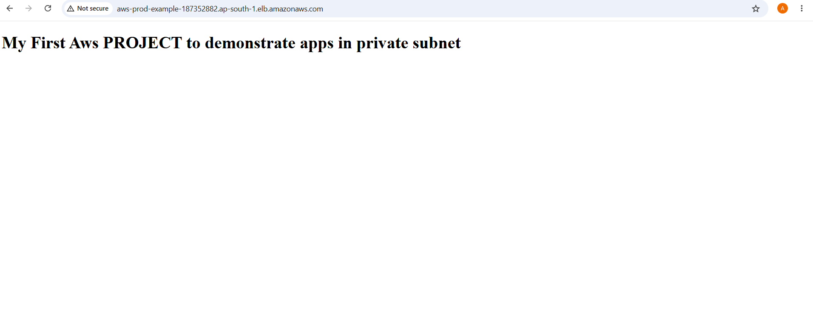

# AWS VPC with Public & Private Subnets in Production

## 📌 Project Overview

This project demonstrates a highly available web application architecture using AWS VPC with public and private subnets.

The architecture uses an Application Load Balancer to distribute traffic across private EC2 instances.

## 🏗️ Architecture

## ☁️ AWS Services Used

- Amazon VPC
- EC2
- Application Load Balancer
- Target Groups
- Auto Scaling
- Security Groups
- Route Tables
- Internet Gateway
- NAT Gateway
- Bastion Host

## 🌐 Network Architecture

The VPC is divided into public and private subnets.

### Public Subnets

Public subnets contain resources that need internet access:

- Application Load Balancer
- Bastion Host
- NAT Gateway

### Private Subnets

Private subnets contain the application EC2 instances.

The private EC2 instances are not directly accessible from the internet.

Traffic reaches the Application Load Balancer first, which forwards requests to the private EC2 instances.

## 🔐 Bastion Host

A Bastion Host is deployed in a public subnet.

It provides controlled SSH access to the private EC2 instances.

## ⚖️ Application Load Balancer

The Application Load Balancer distributes incoming traffic across the private EC2 instances.

It also performs health checks and sends traffic only to healthy instances.

## 📸 Screenshots

### VPC Architecture

### Bastion Host

### Private EC2 Instance - 1A

### Private EC2 Instance - 1B

### Target Group Health

### Load Balancer

### Application Working

### Security Group Rules

### Route Tables

### Load Balancer Health

### Load Balancer Application

## 📚 What I Learned

- Creating an AWS VPC
- Creating public and private subnets
- Configuring route tables
- Using Internet Gateway and NAT Gateway
- Launching EC2 instances
- Creating a Bastion Host
- Configuring Security Groups
- Creating an Application Load Balancer
- Creating Target Groups
- Performing health checks
- Routing traffic to private EC2 instances
